# Interactive Editor Playground
The core editor in VS Code is packed with features. This page highlights a number of them and lets you interactively try them out through the use of a number of embedded editors. For full details on the editor features for VS Code and more head over to our [documentation](https://code.visualstudio.com/docs#vscode).

- [Multi-cursor Editing](#Multi-Cursor-Editing) - block selection, select all occurrences, add additional cursors and more
- IntelliSense - get code assistance and parameter suggestions for your code and external modules
- Line Actions - quickly move lines around to re-order your code.
- Rename Refactoring - quickly rename symbols across your code base.
- Refactoring via Extraction - quickly extract common code into a separate function or constant.
- Formatting - keep your code looking great with inbuilt document & selection formatting.
- Code Folding - focus on the most relevant parts of your code by folding other areas.
- Errors and Warnings - see errors and warning as you type.
- Snippets - spend less time typing with snippets.
- Emmet - integrated Emmet support takes HTML and CSS editing to the next level.
- JavaScript Type Checking - perform type checking on your JavaScript file using TypeScript with zero configuraion.

## Multi-Cursor Editing
Using multiple cursors allows you to edit multiple parts of the document at once, greatly improving your productivity. Try the following actions in the code block below:

1. Box Selection - press any combination of  `⇧⌥⌘↓`, `⇧⌥⌘→`, `⇧⌥⌘↑`, `⇧⌥⌘←` to select a block of text. You can also press `⇧⌥` while selecting text with the mouse.
2. Add a cursor - press `⌥⌘↑` to add a new cursor above, or `⌥⌘↓` to add a new cursor below. You can also use your mouse with `⌥+Click` to add a cursor anywhere.
3. Create cursors on all occurrences of a string - select one instance of a string e.g. `background-color` and press `⇧⌘L`. Now you can replace all instances by simply typing.

That is the tip of the iceberg for multi-cursor editing. Have a look at the selection menu and our handy [keyboard reference guide](https://code.visualstudio.com/shortcuts/keyboard-shortcuts-macos.pdf) for additional actions.

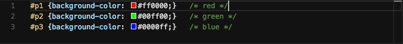

> CSS Tipe: you may have noticed in the example above we also provide color swatches inline for CSS, additionally if you hover over an element such as `#p1` we will show how this is represented in HTML. These swatches also act as color pickers that allow you to easily change a color value. A simple example of some lanuage-specific editor features.

## IntelliSense
Visual Studio Code comes with the powerful IntelliSense for JavaScript and TypeScript pre-installed. In the below example, position the text cursor in front of the error underline, right after the dot and press `⌃Space` to invoke IntelliSense. Notice how the suggestion comes from the Request API.

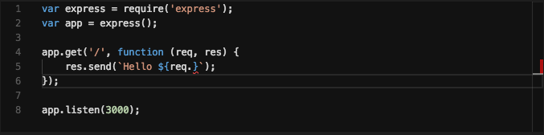

> Tip: while we ship JavaScript and TypeScript support out of the box other languages can be upgraded with better IntelliSense through one of the many `extensions`.

## Line Actions
Since it's very common to work with the entire text in a line we provide a set of useful shortcuts to help with this.

1. Copy a line and insert it above or below the current position with `⇧⌥↓` or `⇧⌥↑` respectively.
2. Move an entire line or selection of lines up or down with `⌥↑` and `⌥↓` respectively.
3. Delete the entire line with `⇧⌘K`.

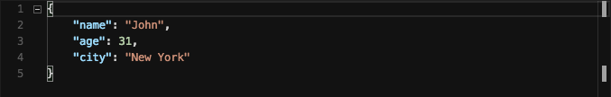

> Tip: Anoher very common task is to comment out a block of code - you can toggle commenting by pressing `⌘/`.

## Rename Refactoring
It's easy to rename a symbol such as a function name or variable name. Hit `F2` while in the symbol `Book` to rename all instances - this will occur across all files in a project. You can also see refactoring in the right-click context menu.

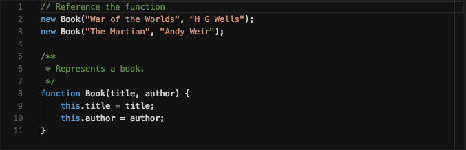

> JSDoc Tip: The example above also showcased another way to get IntelliSense hints by using `JSDoc` comments. You can try this out by invoking the `Book` function and seeing the enhanced context in the IntelliSense menu for the function as well as parameters.

## Refactoring via Extraction
Sometimes you want to refactor already written code into a separate function or constant to reuse it later. Select the lines you want to refactor out and press `⌘.` or click the little light bulb and choose one of the respective `Extract to...` options. Try it by selecting the code inside the `if`-clause on line 3 or any other common code you want to refactor out.

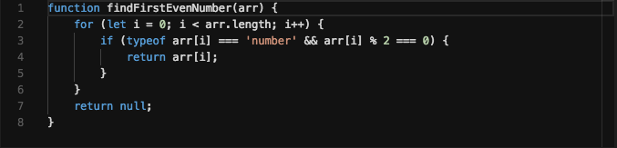

## Formatting
Keeping your code looking great is hard without a good formatter. Luckily it's easy to format content either the entire document with `⇧⌥F`. Formatting can be applied to the current selection with `⌘K ⌘F`. Both of these options are also available through the right-click context menu.

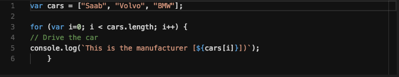

> Tip: Additional formatters are available in the `extension gallery`. Formatting support can also be configured via `settings` e.g. enabling `editor.formatOnSave`.

## Code Folding
In a large file it can often be useful to collapse sections of code to increase readability. To do this you can simply press `⌥⌘[` to fold the code, press `⌥⌘]` to unfold. Folding can also be done with the +/- icons in the left gutter. To fold all sections use `⌘K ⌘0` or to unfold all use `K⌘ J⌘`.

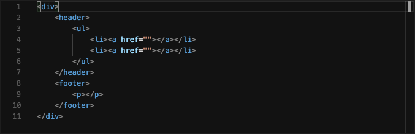

> Tip: Folding is based on indentation and as a result can apply to all languages. Simply indent your code to create a foldable section you can fold a certain number of levels with shortcuts like `⌘K ⌘1` through to `⌘K ⌘5`.

## Errors and Warnings
Errors and warning are highlighted as you edit you code with squiggles. In the sample below you can see a number of syntax errors. By pressing `F8` you can navigate across them in sequence and see the detailed error message. As you correct them the squiggles and scrollbar indicators will update.

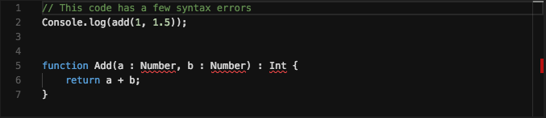

## Snippets
You can greatly accelerate your editing through the use of snippets. Simply start typing `try` and select `trycatch` from the suggestion list and press `Tab` to create a `try`->`catch` block. Your cursor will be placed on the text `error` for easy editing. If more than one parameter exists then press `Tab` to jump to it.

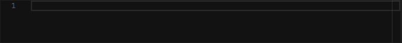

> Tip: the `extension gallery` includes snippets for almost every framework and language imaginable. You can also create your own `user-defined snippets`.

## Emmet
Emmet takes the snippets idea to a whole new level: you can type CSS-like expressions that can be dynamically parsed, and produce output depending on waht you type in the abbreviation. To use Emmet simply run the command `Emmet: Expand Abbreviation` with the cursor at the end of a valid Emmet abbreviation or snippet and the expansion will occur.

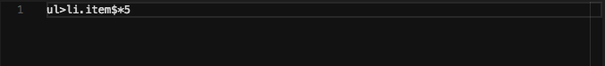

> Tip: The [Emmet cheat sheet](https://docs.emmet.io/cheat-sheet/) is a great sources of Emmet syntax suggestions. To expand Emmet abbreviations and snippets using the `tab` key use the `emmet.triggerExpansionOnTab` setting.

## JavaScript Type Checking
Sometimes type checking your JavaScript code can help you spot mistakes you might have not caught otherwise. You can run the TypeScript type checker against your existing JavaScript code by simply adding a `// @ts-check` comment to the top of your file.

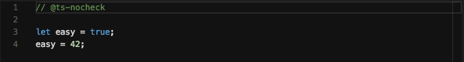

> Tip: You can also enable the checks workspace or application wide by adding `"javascript.implicitProjectConfig.checkJs": true` to you workspace or user settings and explicitly ignoring files or lines using `// @ts-nocheck` and `// @ts-ignore`. Check out the docs on [JavaScript in VS Code](https://code.visualstudio.com/docs/languages/javascript) to learn more.

# Thanks!
Well if you have got this far then you will have touched on some of the editing features in Visual Studio Code. But don't stop now :) We have lots of additional [documentation](https://code.visualstudio.com/docs), [introductory videos](https://code.visualstudio.com/docs/getstarted/introvideos) and [tips and tricks](https://code.visualstudio.com/docs/getstarted/tips-and-tricks#vscode) for the product that will help you learn how to use it. And while you are here, here are a few additional things you can try:

- Open the Integrated Terminal by pressing `⌃` `, then see what's possilble by [reviewing the terminal documentation](https://code.visualstudio.com/docs/editor/integrated-terminal)
- Work with version control by pressing `⌃⇧G G`. Understand how to stage, commit, change branches, and view diffs and more by reviewing the [version control documentation](https://code.visualstudio.com/docs/editor/versioncontrol)
- Browse thousands of extensions in our integrated gallery by pressing `⇧⌘X`. The [documentation] will show you how to see the most popular extensions, disable installed ones and more.

That's all for now,

Happy Coding!

